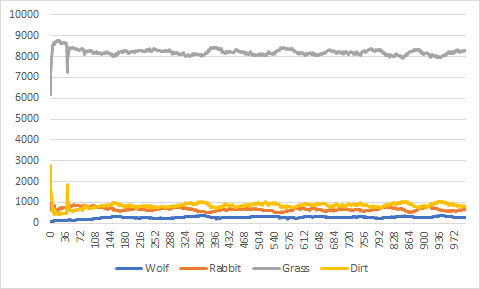
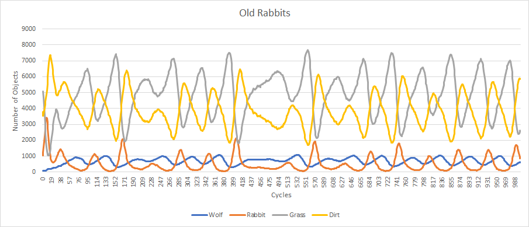
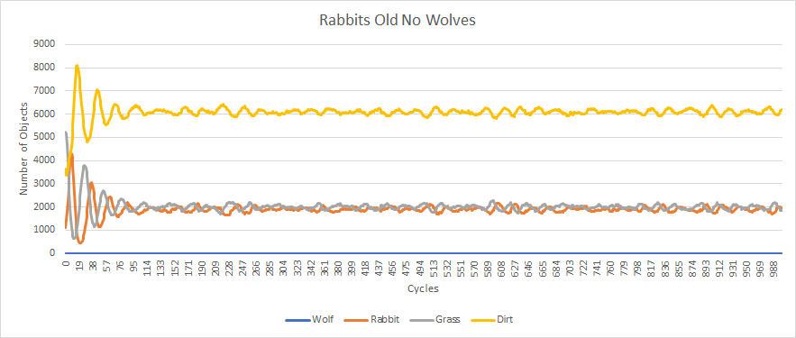
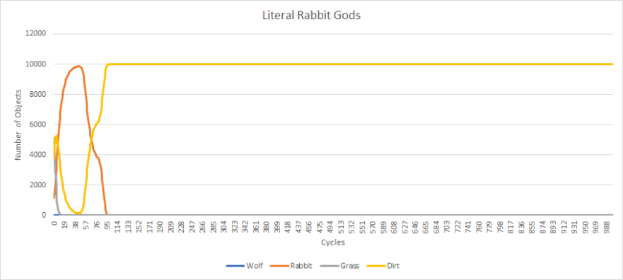
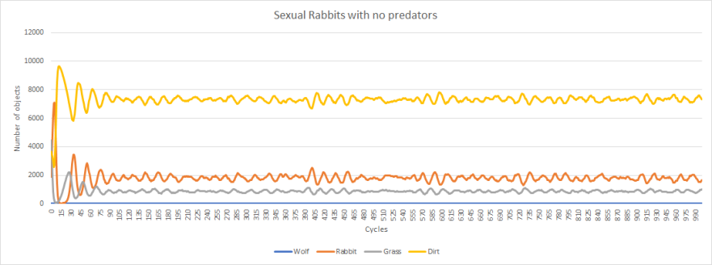
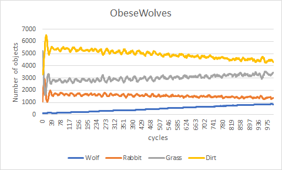
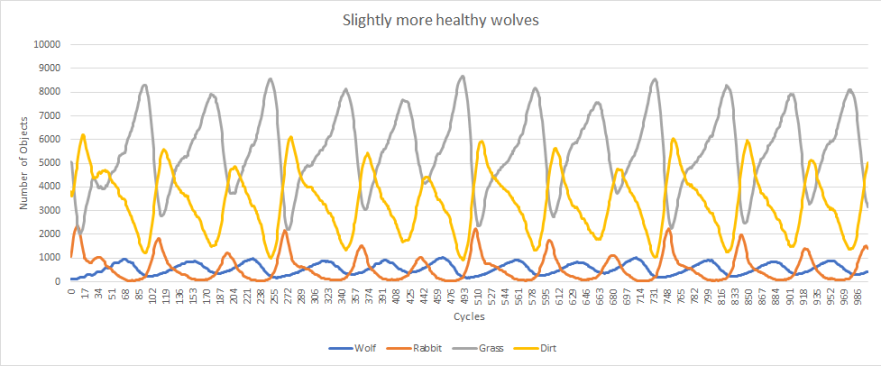
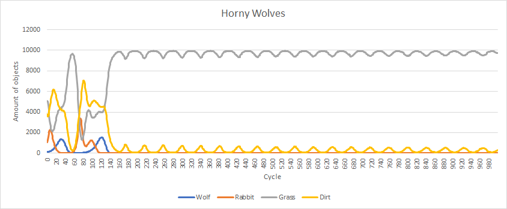

# Description 
    
The purpose of the project is to simulate a real life predator/prey relationship between grass, rabbit, and wolves.

The basic interface assumptions are simple:

* Wolves will eat Rabbits.
* Rabbits will eat grass.
* Grass will take up space.

Wolves, Rabbits, and Grass will all behave according to a certain rule, and each will primarily do three things: 

  * Move
  * Populate
  * get Eaten

This cycle repeats itself for a specific number of times as the elements interact with each other on a 2D array.

# Requirements:

A "World" class

  * Initializes and keeps the 2D array of pointers
  
One Base class to make up the array

  * Grid.h

4 derived class

  * Wolf.h
  * Rabbit.h
  * Grass.h
  * Dirt.h
  
Function class

  * void replace(World &grid, Grid *k, int i, int j);
    * replaces grid[i][j] with object k

  * bool checkHierachy(World &grid, Grid *current, Grid *comingIn, int i, int j);
    * the functions checks if the incoming object will replace and devour the current object, or would it simply get replaced.

  * bool checkHierachy(World &grid, int Currenti, int Currentj, int comingIni, int comingInj);
    * This is used for Moving around
  
  * void moveAway(World &grid, int currentX, int currentY);
    * This function controls how the pointer moves around (if it can)

  * void populate(World &grid, int x, int y);
    * This function will multiply the number of organisms after it is born.

    
    * Whether the organism will spawn or not is dependent on its age modulus spawnrate. If it is zero then it will spawn more objects of the same type with half health around it.    
    
        
  * Grid* ptrGenerator(Grid *k); 
    * Generates pointer that conforms with parameter.
  * void print(World &grid); 
    * print out the whole world grid
  * void write_csv(std::string filename,std::vector<std::pair<std::string, std::vector<int>>> dataset);
    * Writes the csv file to keep all the data.

Parameter.h

  * Simply keeps the parameters for Wolf and Rabbits

  * Included parameters is walking distance, max health, max age, and spawnrate

# Overview of Simulation: 

First, initialize a "world" with nxn size.

Second, fill it with a limited number of wolves and rabbits(in random). THe rest is filled with either dirt or grass.

Third: Set a number of cycle

Fourth: Start simulation

* First: Populate each grid

* Second: Make each and every grid count "act"(Increase in age, decrease in health, Check if it is going to die from not enough food or at a max age)

* Third: Animal moves around

* Fourth: Keep data inside vectors to be used to make csv file later

* Fourth: Make a CSV file for all the data we have aquired.

# Detailed Report

Each grid will start of parameters (all const). They will interact with these parameters

The important thing to note is Grass and dirt CAN'T move and WILL NOT die from Health problems.

Standard Parameters:

    int cycle = 1000;
    int n=100;
    const int initialRabbitNum = 1000;
    const int initialWolfNum = 100;

    const int rabbitWalk = 35;
    const int rabbitMaxHealth = 6;
    const int rabbitMaxAge = 10;
    const int rabbitSpawnrate = 3;

    const int wolfWalk = 50;
    const int wolfMaxHealth = 40;
    const int wolfMaxAge = 80;
    const int wolfSpawnrate = 20;

    const int grassWalk = 0;
    const int grassMaxHealth = 20;
    const int grassMaxAge = 40;
    const int grassSpawnrate = 1;

## PSA: __BEFORE WE MOVE ON: SPAWNRATE IS INVERSELY PROPORTIONAL TO FERTILITY__

    const int initialRabbitNum = 1000;
    const int initialWolfNum = 0;

    const int initialRabbitNum = 0;
    const int initialWolfNum = 1000;

* As expected of trying to simulate natural ecosystem, the balance of all things are very fragile. 
* Now we will destroy that balance

* To preface our experimentation, the way this experiment is set up assumes that wolves are k-selected species, in other words they live long lives but is less fertile. They are the apex of this ecosystem

* Rabbits are very fertile but doesn't live very long.

* Grass spreads, there should always be more grass than rabbits else they can't survive.

## Experiments

* First, we want to break the balance of the ecosystem, we will start from the down up, grass to wolves.

### Grass

* For this experiment, we will increase the "spawnrate" value of grass, which will __decrease__ its __fertility__
  
    const int grassSpawnrate = 5;

.png)

* Very interestingly, it seems that the low grass fertility has wrecked the number of rabbits to the extent that they can no longer support the wolves' population.

* Here is the close up image of the first 100 cycles
  

* After wolves are gotten rid off, the rabbit is left with no enemy and eventually stabalizes out.
  * But because grass spawnrate is low rabbit pop plunges down again

* That is it for grasses. If we decrease its fertility any further it would simply kill off all other species because of the unsustainability
  
* It is useless to teach age or health, since grasses live from water and its health isn't important. (Unless we literally make it 1, but that isn't interesting, it would just kill of grasses faster to the point of ridiculousness)

* For the curious, this is when Grass has max age of 2, it isn't able to sustain the world as much and this is what its left with. 
  
    const int grassMaxAge = 40;

### Rabbits
* For rabbits, we will be messing around with all parameters.

First is the Walk parameter, this factor controls how much the rabbit can roam around. We can decrease this.

* Rabbits NEED to move around to eat. If not, it might just die off
  
    const int rabbitWalk = 1;

* As you can see, in the huge abundance of food, the animal isn't able to prosper at all despite that. This is because the rabbit can barely eat any of it.
* One thing to note: Even if the rabbitWalk is 0, the rabbit would still survive, but mainly because the grasses "grow" into the rabbit, not the other way aroudn. It's like staying in place and waiting for food to pass by.

Next, we will be Testing Max Age of rabbits.

* Rabbits are given a lower max age because they have very short natural lifespans. (We are trying to simulate nature)
* What if we increase it?

    const int rabbitMaxAge = 100;

* Interestingly enough, nothing major has changed! THis is because even though rabbits has become strong, wolves are keeping them in check.
* But what if we removed wolves?
      const int initialWolfNum = 0;

  

* The Rabbits have reached their carrying capacity! Unlike earlier where the rabbits couldn't because of their voliatile max age values.
* It is possible to hypothesize that the reason Rabbits does not need a higher age is because the presence of wolves negates its necessity.

Next, we're gonna test max health. 
* Rabbits are naturally small creatures who need to eat often to survive. What if we make it so it doensn't need to eat often?

  const int rabbitMaxHealth = 100;

* Once again our attempt to destroy balance is destroyed because of wolves! Wolves truly are the keepers of balance. It doesn't matter how healthy you are if you get eaten anyways.
* So we will remove wolves again.
    const int initialWolfNum = 0;

* The rabbits have exceeded the carrying capacity and number of grasses! Because they are so ridiculously healthy they don't die out, but the grasses don't either because the rabbits still die of old age.
* But what if we also increase max age?

    const int rabbitMaxHealth = 100;
    const int rabbitMaxAge = 100;

* They all die out because they ate all the grass and even though they live for ridiculously long times, they're still mortal

Finally we take a look at their spawnrate! This time, we will make them VERY fertile 

    const int rabbitSpawnrate = 1; //note that the spawnrate is inversely proportional to fertility

* The rate in which the rabbits increases after the number of food and wolves has gone down is extremely fast, but once again, the society is somehow in balance. This is because the wolves still keep it in check. It is important to note that the higher population of rabbit allows for more wolves.
* So lets remove the wolves
      const int initialWolfNum = 0;

* Similar to earlier, the rabbits still die of old age.

## Wolves

We'll do a similar thing to wolves.

First off, we'll start with Walk. What if wolves can't walk?

    const int wolfWalk = 0;

* It starts out rough for the wolves, but eventually it manages to even out by waiting for rabbits to come. The number of wolves steadily increases.  

Next, we will try to decrease the max health of wolves. 
* Wolves can live longer without food compared to rabbits in nature, so now we try decreasing the value.

    const int wolfMaxHealth = 35;( a simple 5 decrease)

* Shockingly, with only a decrease of 5, it manages to already delete the wolf population. Unlike rabbits, wolves do not have an abundance of food, as its number is dependent on the more fragile rabbits.

* If we increase it to 50 instead

    const int wolfMaxHealth = 50;

* The wolves still manages to survive out without murdering all the rabbits.

* Anymore or less than this results in the extinction of rabbits, which then causes the wolves to die out.

Furthermore, decreasing the age of the wolves does not matter as much, since the true limitation on their population is rabbit number(Already tested, literally just same balanced graphs)

Lastly, the spawnrate of wolves, it's not hard to guess what happens. Naturally, wolves do not give birth much, but 

* what if we increase its spawnrate?
    const int wolfSpawnrate = 10;

And that is it! We can conclude from this that the environemnt we have made is very dependant on all the elements in the ecosystem. In real nature, the complexity is much more intricate than our simulation, but our simulation does give us information about the importance of apex predators in the environment, and how they control the amount of creatures below. 

* Demonstration of amount of grass with and without wolves to control rabbit population

* Without wolves, more than half of the landscape will be filled with dirt, which is obviously every unhealthy in real life ecosystem, because nothing substantial can grow at all.

# Detailed usecase
The Use case is simple, the user simply changes the values in the Parameters.h to suit their needs, then build and run the program. 

* intial___Num= indicates the max amount of object for the name in ___ at the start. 
* n= the length and width of the world
* _____Walk= The nxn distance in which the object can travel
* _____MaxHealth = the maximum health the animal will have(Will be halved at the start). This isn't the "health" of the aimal, just a parameter for the initial. Animal will die when health reaches 0. (Grasses are immune to health effects)
* _____MaxAge =  The maximum time the object can act regardless of health. 
* ____SpawnRate= the number of acts the object will need to perform before they repopulate. __THIS IS INVERSELY PROPORTIONAL TO FERTILITY. THE HIGHER IT IS THE LOWER THE FERTILITY__

* Note: Dirt class is basically a NULL. It will not move nor repopulate or do anything.
* Note 2: Look at the bold besides spawnrate parameter __carefully__
* PS: Be sure to close the CSV file before you build and run the program. If you left the CSV file open while running the program its data will not change!

# Works Cited
    https://www.gormanalysis.com/blog/reading-and-writing-csv-files-with-cpp/
